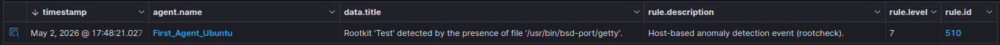
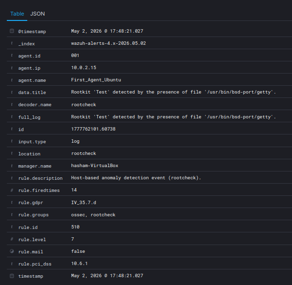

# Rootcheck

## Purpose

The purpose of Rootcheck is to detect suspicious files, rootkit artifacts, and any locally based suspicious activity on the Ubuntu endpoint.

## Configuration

Rootcheck was enabled on the Ubuntu endpoint.

Wazuh agent configuration file:

```text
/var/ossec/etc/ossec.conf

<rootcheck>
  <disabled>no</disabled>
  <frequency>120</frequency>
</rootcheck>
```
The scan frequency was set lower during actual testing to achieve faster results.

## Testing

I used Wazuh Rootcheck to test whether the endpoint could detect a suspicious file path that matched a rootkit indicator.

This was a controlled lab test without the use of a real rootkit. I created a fake test artifact and added a custom Rootcheck signature so Wazuh could detect it for this test.

Custom Rootcheck signature file:
```/var/ossec/etc/shared/rootkit_files.txt```

Custom test signature:
```/usr/bin/bsd-port/getty ! Test Rootkit Signature ::```

Rootcheck trojans file:
```/var/ossec/etc/shared/rootkit_trojans.txt```

Below is the image of the rootcheck alert created:

The alert shows that Rootcheck detected the test artifact by matching it with the custom signature.

Image of expanded alert:

_

The expanded alert shows the main Rootcheck event was collected from the Ubuntu endpoint. It confirms the alert came from First_Agent_Ubuntu, shows the detected file path `/usr/bin/bsd-port/getty`, and identifies the event as a Rootcheck detection.

The important fields in this alert are `data.title`, `decoder.name`, `rule.groups`, `rule.id`, and `rule.level`. These fields help confirm what was detected, what part of Wazuh detected it, and how the alert was categorized.

## Takeaways

This test helped me understand how Rootcheck can be an extra layer of security that should be incorporated into security teams to help detect suspicious files or rootkit-style indicators on endpoints.
