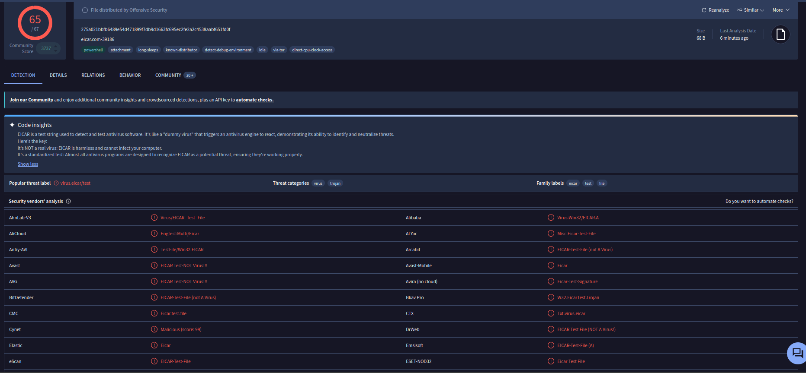

# VirusTotal Integration

## Purpose

The purpose of VirusTotal is to add malware reputation context to any suspicious file activity. VirusTotal provides external reputation information by checking file hashes against its threat intelligence.

## Configuration

VirusTotal was configured on the Wazuh manager through this configuration file:

```text
/var/ossec/etc/ossec.conf

<integration>
  <name>virustotal</name>
  <api_key>REDACTED</api_key>
  <group>syscheck</group>
  <alert_format>json</alert_format>
</integration>
```

## Testing

I tested VirusTotal's integration by creating a malware test file on the Ubuntu agent. Upon creation of the file, Wazuh detected the file, and VirusTotal ran the hash file and created an alert.


In the Wazuh Dashboard, the alert shows that 52 engines had detected the file.



Upon inspecting the document details and opening the VirusTotal link, VirusTotal shows that the file was detected by 52 security vendors and was identified as an EICAR test file. This confirms that the file was a safe antivirus test file and not real malware.
