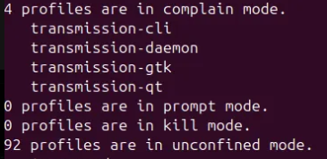

# Threat Hunting

## Purpose

Threat Hunting is used to search for and investigate any security events from the Ubuntu endpoint.

This focuses on specifics, such as alerts and documented investigation notes, that may be useful in the future for other investigations.

**Below are examples of what Threat hunting searches for**

- Malware detection alerts from ClamAV
- File activity events from Wazuh File Integrity Monitoring
- Rootcheck detection alerts
- Events from the Ubuntu endpoint agent

## Investigation: SCA AppArmor Status Change

An event was created in the threat hunting event category, the event was an SCA finding related to AppArmor

**Investigation Steps:**

I reviewed the event details in Wazuh and determined that the event showed that a CIS Ubuntu benchmark check which changed from passing to to failed. This means the endpoint's hardening stance has changed and now requires review.

**Validation**

After identifying the event in Wazuh, I validated the AppArmor state directly on the Ubuntu endpoint.

I reviewed the AppArmor profile with ``sudo aa-status``:

As you can see from the image above, the output showed that AppArmor was loaded, but there were 92 profiles in unconfined mode. 
This was why the alert was generated in Wazuh.

**Remediation**

In order to remediate the problem, I first moved unconfined profiles into complain mode as a safe step, so it will still log violations rather than nothing, which is what unconfined profiles do. I then reviewed whether specific profiles could be placed into enforce mode without disrupting the agent.

### Remediation Verification

After moving the AppArmor profiles into complain mode, I restarted the Wazuh agent and allowed SCA to rescan the endpoint.

Wazuh then generated a new SCA event showing that the AppArmor benchmark check changed from `failed` to `passed`.

This confirmed that the fix was successful and that all the AppArmor profiles were now in an accepted state for the CIS check.
