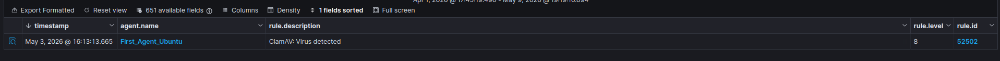

# ClamAV Integration

## Purpose

The purpose of this section is to document how ClamAV was used as the malware detection tool and how it was integrated with Wazuh for a centralized SIEM alerting system.

## ClamAV Role

ClamAV is used to detect malware and prevention on the Linux endpoint.

ClamAV has many configurations, the following is what I've incorporated:
- ClamAV monitors the protected user path with on-access scanning
- Malware test files are blocked for normal user access to ensure no further damage occurs
- ClamAV detections are written to a local log file for review
- Wazuh collects the ClamAV log and generates SIEM alerts

## Wazuh Log Collection

The Linux Wazuh agent was configured to collect ClamAV logs from: `/var/log/clamav/clamav.log`

This allows Wazuh to collect the ClamAV log entries and generate alerts when malware detections occur

## Detection

The EICAR test file was used to safely validate malware detection.

ClamAV detected the test file and Wazuh generated a malware detection alert.

[Full expanded Wazuh alert](screenshots/1image.png)

Confirmed Wazuh alert:

- Rule ID: `52502`
- Description: `ClamAV: Virus detected`
- Level: `8`

## Prevention

ClamAV's on-access prevention blocks a normal user's access to the malicious test file upon detection to prevent any further damage to occur.

Root still has access to read the test file because root is excluded from the on-access prevention from ClamAV configuration. 
This means normal user access to detected malware was blocked, but root access was still given.
