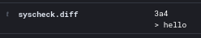

# File Integrity Monitoring

## Summary

For this part of the lab, I configured Wazuh's File Integrity Monitoring on the Ubuntu endpoint with the Wazuh manager.

File Integrity Monitoring is used to detect any creation, modification, or deletion of files on the endpoint.

## Testing

I tested FIM in various ways, including creating, deleting, and modifying files inside the endpoint. 
These changes then create a syscheck event on Wazuh through the FIM Events category. 

We can see that Wazuh generated a syscheck log that gives us the time, which agent was involved, the path, which in this case was for test.txt, and the event that occurred, which is `Integrity checksum changed`.

We can further check the modifications by opening the document details log.

Upon opening the document details, we can view what was changed through the syscheck.diff row. The `> hello` means the text "hello" was added to the file. 

If it were < it would mean it was removed from the file
